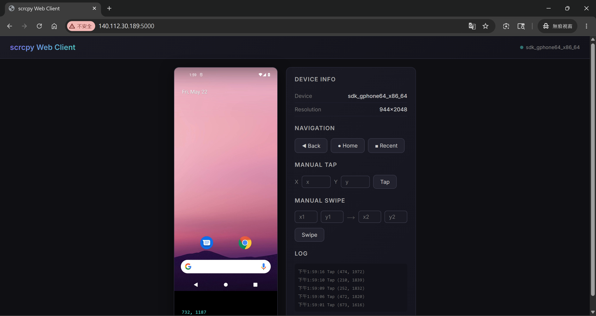
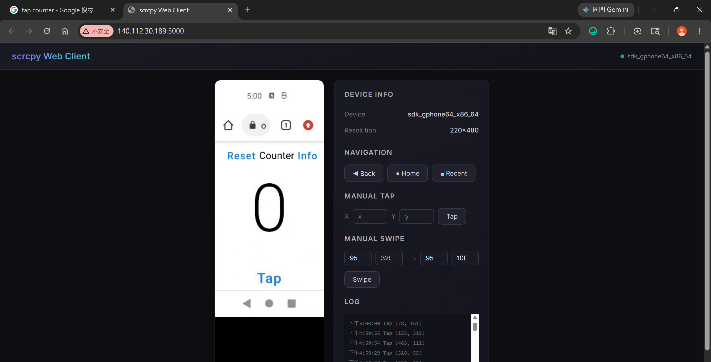
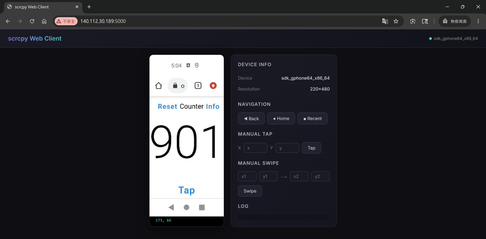

## DRL Final Project Env Setup on CSIE Workstation

1. The repo will be cloned to ~/Desktop/BBBall-RL.
2. The workspace will be /tmp2/$USER/DRL_final_workspace.

### 0. Git clone
```bash
cd ~/Desktop
git clone https://github.com/sinkboy-chen/BBBall-RL.git
```

### 1. Create directories
```bash
mkdir -p /tmp2/$USER/DRL_final_workspace/android-sdk/cmdline-tools
cd /tmp2/$USER/DRL_final_workspace/android-sdk/cmdline-tools
```

### 2. Download & unzip command line tools
Go to https://developer.android.com/studio/index.html#command-line-tools-only and find the latest Linux URL, then:
```bash
wget https://dl.google.com/android/repository/commandlinetools-linux-14742923_latest.zip
unzip commandlinetools-linux-14742923_latest.zip
mv cmdline-tools latest
```

### 3. Set environment variables
```bash
export ANDROID_HOME=/tmp2/$USER/DRL_final_workspace/android-sdk
export ANDROID_SDK_ROOT=$ANDROID_HOME
export ANDROID_USER_HOME=/tmp2/$USER/DRL_final_workspace/.android
export ANDROID_AVD_HOME=/tmp2/$USER/DRL_final_workspace/.android/avd
export PATH=$PATH:$ANDROID_HOME/cmdline-tools/latest/bin:$ANDROID_HOME/platform-tools:$ANDROID_HOME/emulator
export ANDROID_EMULATOR_HOME=/tmp2/$USER/DRL_final_workspace/.android
```

### 4. Create cache and AVD directories
```bash
mkdir -p $ANDROID_USER_HOME/cache
mkdir -p $ANDROID_AVD_HOME
```

### 5. Accept licenses
```bash
sdkmanager --licenses
```
Press `y` for all prompts.

### 6. Install SDK packages (1 mins)
```bash
sdkmanager \
  "platform-tools" \
  "platforms;android-31" \
  "system-images;android-31;google_apis;x86_64" \
  "emulator"
```

### 7. Create AVD (Pixel 5, API 31)
```bash
avdmanager create avd \
  -n pixel5_api31 \
  -k "system-images;android-31;google_apis;x86_64" \
  -d "pixel_5"
```

### 8. First launch — cold boot (one time only, takes 5 mins)
```bash
emulator -avd pixel5_api31 \
  -no-window \
  -no-audio \
  -no-boot-anim \
  -gpu swiftshader_indirect \
  -no-metrics &
```

**Run this, then open a new terminal to run the next step. It's okay if this step produces warnings or errors; ignore them.**

### 9. Install your APK

Open another terminal, run **Step3: Set environment variables** first then

```bash
until adb shell getprop sys.boot_completed 2>/dev/null | grep -q "1" && \
      adb shell service check package 2>/dev/null | grep -q "found"; do
  echo "Waiting for package manager..."; sleep 5
done
echo "Ready! Installing..."
adb install ~/Desktop/BBBall-RL/assets/Bouncy_Basketball.apk
echo "Setting resolution..."
adb shell wm size 540x1170
```

The apk is downloaded from: https://l.messenger.com/l.php?u=https%3A%2F%2Fd.apkpure.com%2Fb%2FAPK%2Fcom.DreamonStudios.BouncyBasketball%3FversionCode%3D16%26nc%3Darm64-v8a%252Carmeabi-v7a%26sv%3D22&h=AUBKzxIjRWoqsZgNACxOY84CFXcBIyxz2ctSxgbHr2qKbpzzSrhoEc8TNnG6ht4DMuGyAKVJWx9iPVM39k-5sqoRx2c1fRZRZtaJRnsfbmk5gw0pR8bIctrraJT1NXw


### 10. Save snapshot (one time only, after APK installed)
```bash
adb emu avd snapshot save clean_boot
```
Snapshot is saved to:
`$ANDROID_AVD_HOME/pixel5_api31.avd/snapshots/clean_boot/`

Kill the emulator after saving:
```bash
adb emu kill
```

### 11. Subsequent launches — fast boot from snapshot (~10 sec)

ensure **Step3: Set environment variables** is executed

```bash
emulator -avd pixel5_api31 \
  -no-window \
  -no-audio \
  -no-boot-anim \
  -gpu swiftshader_indirect \
  -no-metrics \
  -snapshot clean_boot &
```

Wait for boot:
```bash
until adb shell getprop sys.boot_completed 2>/dev/null | grep -q "1"; do
  echo "Waiting for boot..."; sleep 3
done
echo "Device ready!"
```

### 12. Install scrcpy
```bash!
cd /tmp2/$USER/DRL_final_workspace
wget https://github.com/Genymobile/scrcpy/releases/download/v4.0/scrcpy-linux-x86_64-v4.0.tar.gz
tar -xvf scrcpy-linux-x86_64-v4.0.tar.gz
```

### 13. Setup python venv
```bash
cd /tmp2/$USER/DRL_final_workspace
uv venv --python 3.12
source .venv/bin/activate
uv pip install av numpy opencv-python flask
```

### 14. Inspect emulator with web_server.py
```bash
cd /tmp2/$USER/DRL_final_workspace
source .venv/bin/activate
python ~/Desktop/BBBall-RL/env_scripts/web_server.py
```


### 14. Benchmark latency with benchmark_h264.py


```bash
cd /tmp2/$USER/DRL_final_workspace
source .venv/bin/activate
python ~/Desktop/BBBall-RL/env_scripts/web_server.py
```

Ensure the phone is connected to the internet.
Open chrome browser, search for "tap samvlu".
Go to https://samvlu.github.io/web-04-tap-counter/.
Ensure the counter is reset.



Stop the web_server.py. Then start benchmark_h264.py

```bash
python ~/Desktop/BBBall-RL/env_scripts/benchmark_h264.py
```

result:
```
======================================================================
  H.264 BENCHMARK RESULTS  (900 successful, 0 timeouts)
  scrcpy max_size=585  poll_interval=50ms  threshold=2.0
======================================================================

  Round-trip (tap → H.264 frame shows change):
    mean =   104.4 ms
    std  =    13.7 ms
    min  =    56.5 ms
    max  =   128.0 ms
    p50  =   108.1 ms
    p95  =   108.7 ms

  Polls until change:
    mean =     2.9
    min  =       2
    max  =       3
    avg poll time = 50.2 ms (sleep 50ms + get_frame 0.2ms + cmp 0.02ms)

  get_frame() time:     mean = 0.178 ms
  crop+compare time:    mean = 0.018 ms
  tap() time:           mean = 5.3 ms  (includes 5ms sleep)
  screenshot save time: mean = 15.5 ms

  What each measurement means:
    round_trip  = tap() → Android → render → H.264 encode → TCP → decode → detected
    get_frame() = mutex lock + numpy copy of latest decoded frame
    tap()       = sendall(DOWN) + 5ms sleep + sendall(UP)
    crop+cmp    = numpy slice + mean absolute difference > 2.0

  Estimated RL step rate: ~9.1 steps/sec (RT 104ms + tap 5ms)
  Video resolution: 268x584 (max_size=585)
```

Open the webserver again:


We can also check the screenshots in env_scripts/benchmark_h264.